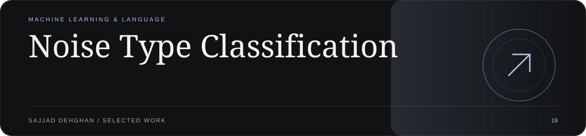
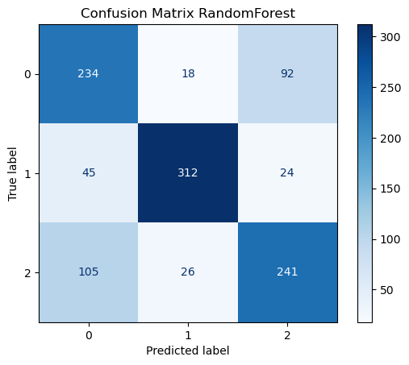
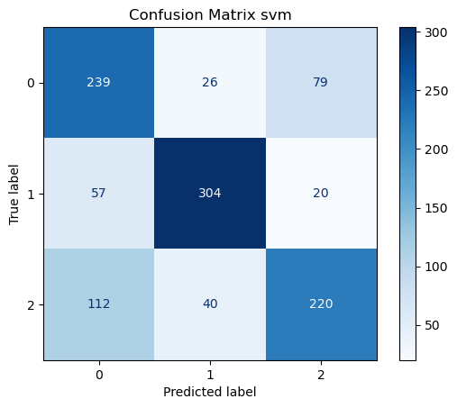
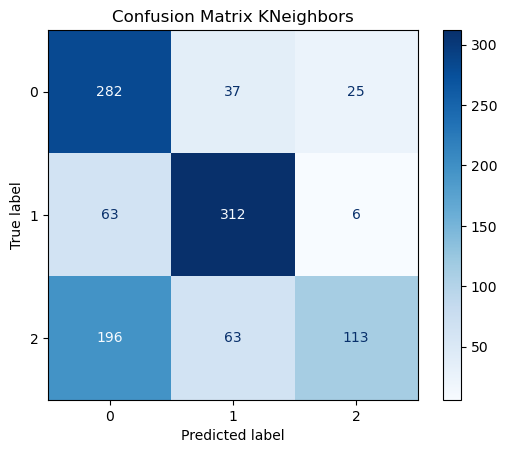
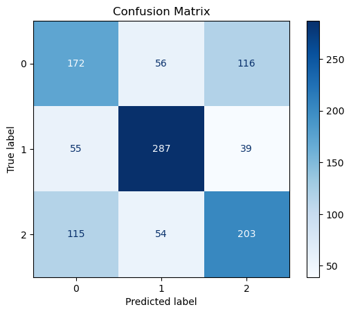

<!-- visual-showroom:start -->
<p align="center">
  
</p>

<p align="center">
  <strong>Noise Type Classification</strong><br>
  MACHINE LEARNING &amp; LANGUAGE
</p>

<p align="center">
  <a href="https://sajjad-dehghan-personal-site.prisoner-sedwna.workers.dev/projects/noise-type-classification"><strong>Explore the showroom ↗</strong></a> ·
  <a href="#implementation--original-documentation">Setup &amp; implementation ↓</a>
</p>

Tells which kind of noise an image has (Gaussian, periodic or salt-and-pepper) from its histogram, comparing random forest, SVC, KNN and decision tree on 1,566 images.

## Visual tour

[](https://sajjad-dehghan-personal-site.prisoner-sedwna.workers.dev/projects/noise-type-classification)

<p align="center">
  <a href="https://sajjad-dehghan-personal-site.prisoner-sedwna.workers.dev/projects/noise-type-classification"></a>
  <a href="https://sajjad-dehghan-personal-site.prisoner-sedwna.workers.dev/projects/noise-type-classification"></a>
  <a href="https://sajjad-dehghan-personal-site.prisoner-sedwna.workers.dev/projects/noise-type-classification"></a>
</p>

1. Random-forest confusion matrix · original notebook output
2. SVC confusion matrix · saved notebook output
3. KNN confusion matrix · saved notebook output
4. Decision tree confusion matrix · saved notebook output

Original saved notebook outputs, not a product UI or a general model accuracy claim.

## Implementation & original documentation

The existing run instructions, architecture, limitations and credits are preserved below.

---
<!-- visual-showroom:end -->

# Image Noise Type Classification

Classifying the type of noise in an image (**Gaussian**, **Periodic**, or **Salt & Pepper**) using classic machine-learning models with OpenCV and scikit-learn.

## Dataset

- `data/Labels.csv` maps each image file name to its noise type (`image_name`, `noise_type`), 1,566 rows in total.
- Class counts printed in the notebook:

  | Noise type    | Images |
  |---------------|-------:|
  | Gaussian      | 496    |
  | Periodic      | 533    |
  | Salt & Pepper | 537    |

- The notebook reads the images from `data/Noisy/`. **That folder isn't in this repository.** Add the noisy images there before you run the notebook.

## Approach

All steps are in `src/main.ipynb`:

1. Load the labels with pandas and the images with OpenCV.
2. Resize every image to 64 x 64 and normalize it.
3. **Feature extraction:** convert to grayscale and compute a 256-bin intensity histogram (`cv2.calcHist`) as the feature vector.
4. Train and compare four scikit-learn classifiers on the histogram features (`train_test_split` with `test_size=0.7`, `random_state=42`):
   - Random Forest
   - Support Vector Classifier (SVC)
   - k-Nearest Neighbors (k = 5)
   - Decision Tree
5. Evaluate each model with accuracy and a confusion matrix.
6. Extra experiment: a Decision Tree trained on raw flattened 64 x 64 grayscale pixels (Pillow, `test_size=0.3`). Its misclassified samples are collected in a DataFrame.

## Results

Accuracy as printed in the notebook:

| Model                          | Features            | Accuracy |
|--------------------------------|---------------------|---------:|
| Random Forest                  | Histogram           | 0.7174111212397447 |
| SVC                            | Histogram           | 0.6955332725615314 |
| k-Nearest Neighbors (k=5)      | Histogram           | 0.6444849589790337 |
| Decision Tree                  | Histogram           | 0.6034639927073838 |
| Decision Tree                  | Raw pixels (64x64)  | 0.551063829787234  |

## Tech Stack

Python, Jupyter Notebook, OpenCV, NumPy, pandas, Pillow, scikit-learn, Matplotlib

## Project Structure

```
image-noise-removal/
├── data/
│   └── Labels.csv      # image name -> noise type
└── src/
    └── main.ipynb      # feature extraction, training and evaluation
```

## How to Run

There is no `requirements.txt`, so install the libraries the notebook imports:

```bash
pip install opencv-python numpy pandas pillow scikit-learn matplotlib notebook
```

Put the noisy images in `data/Noisy/`, then open the notebook from the `src/` folder. It uses relative paths like `../data/Labels.csv`.

```bash
cd src
jupyter notebook main.ipynb
```
